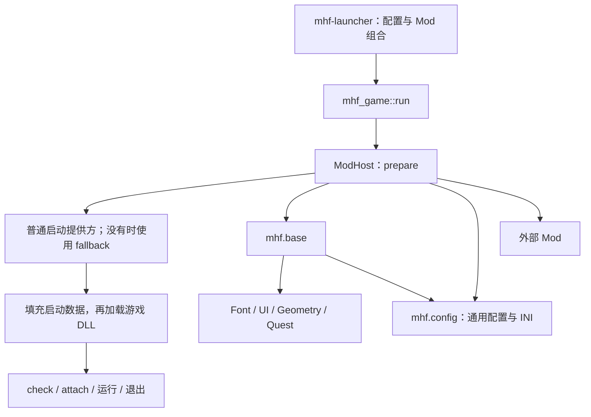

# 游戏宿主与 Mod 管理

客户端固定为 HD `mhfo-hd.dll`，目标为 `i686-pc-windows-msvc`。唯一入口是 `mhf-launcher`，登录和调试由不同启动 Mod 提供。真实游戏中的组合安装、输入、开图和退出仍需验证。

## 实现位置

所有 crate 按领域归入 `crates/{mods,runtime,shared,apps}`，入口见 [工作区目录](../README.md)。
启动应用组装已编译的 Mod，通用游戏宿主通过公开启动接口准备会话。

| 位置 | 职责 |
| --- | --- |
| [`runtime/game`](../crates/runtime/game/README.md) | 通用游戏入口、生命周期、游戏 DLL 与启动 ABI、最终退出 |
| [`apps/launcher/src/builtins.rs`](../crates/apps/launcher/src/builtins.rs) | 内置 Factory 与 Base／Debug 注册表接线 |
| [`mods/`](../crates/mods/) | 各领域的公开 API、Service、内置 Module、资源和原生 Hook |
| [`runtime/mod-host`](../crates/runtime/mod-host/README.md) | 内置／DLL／数据实例、阶段、接口发布、依赖绑定和失败保留 |
| [`runtime/mod-api`](../crates/runtime/mod-api/src/lib.rs) / [`mod-sdk`](../crates/runtime/mod-sdk/README.md) | 基础 C 协议及 Rust 生命周期、Host、Hook 绑定 |
| [`runtime/hooks`](../crates/runtime/hooks/src/lib.rs) | Hook 所有权、目标占用、排空与退役状态 |
| [`runtime/mod-package`](../crates/runtime/mod-package/README.md) | 通用清单、semver、包发现、依赖解析与 ZIP 读写 |
| [`apps/mod-manager`](../crates/apps/mod-manager/README.md) | `mhf-mods` 独立管理界面、命令行及启用设置编辑 |
| [`apps/launcher-catalog`](../crates/apps/launcher-catalog/README.md) | Launcher 与管理器共用的内建 Mod 元数据和默认项 |
| [`apps/launcher`](../crates/apps/launcher/README.md) | 唯一启动入口、配置准备、Mod 组合、头文件聚合 |
| [`shared/egui-hunter`](../crates/shared/egui-hunter/README.md) | 复用的 egui 组件与输入交互 |
| [`shared/resource`](../crates/shared/resource/README.md) | 游戏资源格式类型（DAT／INF／SDT／FMOD 等）的解析与写回 |

应用的 `src/runtime.rs` 读取配置、解析路径并映射常规游戏设置，构造 `mhf_game::LaunchConfig`。
应用解析包选择后传给 `mhf_game::run`；`--list-mods`、`--export-modpack` 在应用内完成，不加载游戏或 Mod DLL。
Login 持有 Sign、登录 UI 与凭据，Debug 持有临时猎人启动和调试工具。Mod 的内部 Rust 接口是 `mhf_mod_host::Module`，不跨 DLL 传递。

## 宿主和功能的边界

宿主负责依赖、生命周期和基础协调。公开 Host 表提供日志、当前 Mod 配置 TOML、资源目录、最小游戏信息、接口注册／绑定及 Hook 组操作。它不提供字体、UI 控件、离线任务或调试业务。

Font、UI、Quest、DebugTools 的 `src/api` 由所属领域 crate 默认导出；
`provider` feature 增加其 Service、内置 `Module` 和具体实现，API 不依赖 provider。
Cargo 会合并 features；provider 是对 API 的补充，二者可以在同一次构建中同时启用。
具体功能和 Counter 由所属 Mod 实现 `safer_ffi::derive_ReprC(dyn)` trait，以 `VirtualPtr` 发布生成的 C vtable；其 Rust SDK 提供强类型参数、错误和资源操作。基础 Host、生命周期、Hook、Data 与诊断表使用 `derive_ReprC` 生成 C 定义。启动应用、Counter 提供方和 Hook 示例的 `build.rs` 随 Cargo 构建生成头文件到各自的 `OUT_DIR/include`，其他语言可直接使用。

Host 查询到的接口都只借用。C 消费者保存表指针，不复制 `VirtualPtr` 取得所有权，也不调用 `release_vptr`；虚拟对象、Provider 实例及 DLL 继续由宿主按生命周期释放。Ui 表仅在当前渲染回调内借用。



内置 Mod 的运行版本目前为 `1.0.0`，由内置清单给出；外部包版本来自 `mod.toml`。

| ID | 当前职责及选择规则 |
| --- | --- |
| `mhf.config` | 独立配置存储与通用 INI 桥，提供 `mhf.config.v1`；不依赖配置消费者 |
| `mhf.base` | 基础支持，按消费者声明的依赖启用；统一 Font、UI、Geometry 和 Quest，提供 `mhf.font.v1`、`mhf.ui.v1`，向配置桥注册游戏字段与 INI 映射 |
| `mhf.login` | 默认登录启动；依赖 Base 和 Config，提供 `mhf.launch.fallback.v1` |
| `mhf.debug` | 调试启动、临时猎人和游戏工具；仅依赖 Base，提供 `mhf.launch.v1` 与 `mhf.debug-tools.v1` |
| `mhf.workbench` | 资源检查与独立预览；依赖 Base 和 Config，提供普通 `mhf.launch.v1`，与 Debug 同时启用会产生启动提供方冲突 |
| `mhf.dat-redirect` | 默认关闭，独立启用后对所有启动模式生效；将游戏 `dat` 下的只读文件打开映射到配置根目录，缺失或打开失败时回退原文件；无 Mod 依赖，配置见 [DatRedirect](../crates/mods/dat-redirect/README.md) |

Font、UI、Quest、Geometry 和 DebugTools 按职责分 crate，但不独立参与运行选择。Unicode 和 Translation 的代码保留，当前不接入应用。
Cargo feature 决定可用实现，配置决定选择。启用 Debug 时，普通启动提供方自动覆盖默认 Login 的 fallback。
宿主优先检查普通提供方，仅在没有普通提供方时检查 fallback；有效层必须恰好有一个，否则在回调前报错。

Debug 原生状态通过 Base 的 `mhf.quest.control.v3` 访问同一任务会话。一般外部 UI 使用 Debug 的命令队列；高级任务控制仅供满足游戏线程约束的调用方。

`mhf_quest::MonsterSpawn`／`prepare_monster_spawn` 准备任务替换中的资源种类、出生记录和猎人起始区，具体二进制操作位于 [`quest/binary.rs`](../crates/mods/quest/src/provider/binary.rs)。它们不直接创建或操纵运行中的怪物。实时怪物控制仍位于现有 Debug 实现，没有因此新增 Monster Mod；当前任务接口也不意味着在线任务已开放调用。

`mhf.debug` 的启动回调写入临时猎人字段；Login 写入认证结果。它们仅在回调期间借用
`LaunchParams32` 和 `GlobalData32`，内存与句柄由宿主持有。Base 在 prepare 发布 Quest 快照、控制与 `mhf.quest.launch.v1`；
Debug 回调将自身预设或自定义任务字节传给 `prepare_local`，Base 在 attach 才安装本地任务 Hook。普通 Login 不激活任务组件。

公开 UI 能力位于 [`mhf-ui::api`](../crates/mods/ui/src/api/mod.rs)：`UiHost` 注册面板，
`Ui` 表示当前回调借用的控件上下文。该领域的 provider 同时包含 `UiMod`／`UiService`、
`Overlay` trait、`OverlayRegistry` 及 D3D9、窗口和 DirectInput 后端。
Debug UI 通过共享注册表提交完整 egui 窗口，当前仍要求内置 Base。

Base 内部持有 Font、UI、Geometry 和 Quest，游戏文本与任务字节保留原生编码。
公开 C Panel 不传递完整 egui 对象；当前内置 Debug 窗口仍要求内置 Base。

## 配置与组合

运行配置只有 `mhf.toml`。[`Config`](../crates/mods/config/README.md) 持有通用 TOML Store 和 INI 桥，
各消费者注册默认值、固定值及可选 INI 映射，自己解释 schema：Base 管理游戏字段，Login 管理 Sign。
配置桥不反向依赖这些 Mod。`[mods]` 使用 `mhf_mod_package::RuntimeConfig`：

```toml
[mods]
directory = "mods"

[mods."example.counter-consumer"]
enabled = true
version = "^1.0"

[mods."example.counter-consumer".settings]
label = "计数器"
```

游戏宿主和管理器的 `directory` 都默认是调用目录中的 `mods`；配置中的相对目录也以调用目录为基准，在切换到游戏工作目录前解析。`settings` 序列化为该 Mod 的配置 TOML，经 Host 表读取。原有游戏设置仍留在原配置节，不为此复制一份运行设置。

`enabled` 区分未设置、明确启用和明确禁用。必需依赖自动加入，但不会覆盖明确禁用。`version` 和包的 `dependencies` 都使用 `semver::VersionReq`；解析器选取满足全部约束的版本，在传递冲突和循环时回溯。同一 ID 最终只选一个候选，相同 ID／版本的重复来源报错。

`mhf-mods`（来自 `apps/mod-manager` 的 `mhf-mod-manager` package）默认打开独立管理界面。
界面刷新并查看内置和外部包及其声明依赖，
设置自动／启用／禁用、semver 范围或已安装精确版本，并预览依赖结果后保存或撤销。
管理器和启动应用共用 `BuiltinCatalog` 的内置元数据、默认启动项与通用 semver 解析器；依赖诊断按实际启动组合检查，未被需要的自动项不报依赖错误。保存和导出按明确启用项及其声明依赖解析。
启动器默认启用 Login，Base 由 Login、Debug 等 Mod 的声明依赖按需带入，
宿主通过公开接口选择启动提供方。
管理器的编译能力决定可用的启动候选，Nix 开发命令共用项目的调试设置。

ZIP 导入和导出在后台执行，不加载 Mod DLL 或游戏。导入不自动启用，不覆盖已有包版本；
GUI 导出已保存配置中明确启用的项及其完整依赖，包含所需内置版本记录，输出文件必须尚不存在。
开关修改保留原 TOML 的其他字段与注释，在下次启动生效。
`list`、`import`、`export`、`enable`、`disable` 子命令仍可用；CLI 导出以显式 ID 或配置中明确启用的项为根。
具体选项见 [管理器用法](../crates/apps/mod-manager/README.md)。

`mhf-mods` 以命令启动时的当前工作目录作为运行目录：默认读取其中的 `mhf.toml`，
使用其中的 `mods` 作为缺省 Mod 目录；配置中的相对 `directory` 和所有显式相对路径也按该目录解析。
工具可安装到 PATH 中，安装位置不影响所管理的目录。即使另选其他目录的配置文件，
相对 Mod 目录仍以调用目录为基准；`--mods-dir` 仅覆盖本次管理，不写回目录设置。
配置与 Mod 目录在启动时通过上述规则或 `--config`／`--mods-dir` 确定，配置文件必须已存在。

## 生命周期

`ModHost` 先按依赖顺序创建实例，再依次推进每个阶段。各 Mod 的 `prepare` 或 `attach` 成功后，才发布该阶段注册的接口；消费者不能在创建时假定提供方已经完成准备。

| 阶段 | 实际工作 |
| --- | --- |
| 解析／创建 | 合并内置和包候选，解析依赖，创建实例并加载所选原生 DLL |
| `prepare` | 准备加载前资源与 INI 桥接；游戏模块指针为空 |
| 启动回调 | 选择普通提供方或 fallback，填充宿主借用的启动数据；取消时直接进入正常清理 |
| 游戏加载 | `NativeGame` 加载游戏 DLL，随后设置借用的模块基址 |
| `check` | 运行各 Mod 的独立预检，例如目标原像验证 |
| `attach` | 安装 Hook、绑定服务、注册界面；部分现有目标检查仍留在对应安装函数内 |
| 运行 | 设置运行阶段并调用游戏主入口 |
| `stop` | 先消费者后提供者，停止私有任务、UI 与原生调用入口 |
| `detach` | 在原生调用结束后撤销功能和 Hook；依赖顺序优先，内置次序只处理无依赖关系的并列项 |
| `prepare_release` | 宿主内部适配器归还额外游戏 DLL 引用，继续保留退役状态与缓冲 |
| 最终释放 | 释放游戏 DLL，保持其 DllMain 所需内存；然后销毁消费者、提供者及其 Mod DLL |

各领域 provider 的内置适配实现 `mhf_mod_host::Module`，包括 `prepare_release`。外部 DLL 使用的
`mhf_mod_sdk::Mod` 和 C 生命周期没有该阶段；领域 crate 不定义 `export_mod!` 入口。
外部 Mod 应在 detach 完成前归还自行取得的游戏 DLL 引用；`game_info.module_base` 本身只是宿主借用。

普通跨 Mod 调用直接经过生成的函数表，不逐次申请许可或登记租约。宿主不持有接口注册表锁调用外部代码；Provider 实例、接口、虚拟对象和 DLL 至少存活到消费者销毁结束。

清理错误保留实例、相关依赖、DLL 和原生缓冲，并返回失败阶段。不能将禁用 Hook 等同于已释放 trampoline，也不能在仍有回调时销毁状态。窗口、IME 和裸汇编入口仍遵守现有线程与停止约束，具体见 [Hook 生命周期](mod-hooks.md)。

## 验证与当前范围

可复现示例位于 [`examples/mods`](../examples/mods/README.md)：macOS 动态库测试检查 C／Rust 调用，Windows x86 [`ModHost smoke`](../crates/runtime/mod-host/examples/smoke.rs) 检查同进程重复加载、依赖调用和 Hook 排空／恢复。[HD DLL 测试](../crates/runtime/game/src/game/tests.rs) 检查最小启动提供方注入和 DLL 加载／卸载，不执行游戏主入口。

各 package 的 `tests/headers.rs` 比较构建产物与仓库中的五个 C 头快照。启动应用使用
`cargo test --manifest-path mhf/Cargo.toml -p mhf-launcher --target i686-pc-windows-msvc --test headers`；
Counter 提供方和 Hook 在各自 workspace 运行同名测试。设置 `MHF_UPDATE_HEADERS=1` 显式更新快照，
或用 `MHF_HEADERS_EXPORT_DIR` 在检查通过后导出已构建的头文件，完整命令见 [头文件生成](dll-mods.md#头文件生成)。

尚需真实 HD 客户端验证 Hook 安装、UI、任务和调试命令、退出释放及重复启动。首版没有原生 Mod 热卸载、任意 detour 链或通用内存补丁区间管理；开关与 DLL 更新在游戏退出后生效。
